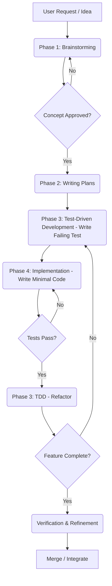

# Workflow: Feature Development (Brainstorming → Planning → TDD)

This document details the structured workflow for developing new features within the SupremePower framework. It emphasizes a disciplined, iterative approach, starting from ideation and moving through planning, testing, and implementation.

## Table of Contents

- [Overview](#overview)
- [The Workflow Stages](#the-workflow-stages)
  - [Phase 1: Brainstorming](#phase-1-brainstorming)
  - [Phase 2: Writing Plans](#phase-2-writing-plans)
  - [Phase 3: Test-Driven Development (TDD)](#phase-3-test-driven-development-tdd)
  - [Phase 4: Implementation](#phase-4-implementation)
  - [Verification and Refinement](#verification-and-refinement)
- [Mermaid Diagram](#mermaid-diagram)

---

## Overview

The feature development workflow is designed to ensure that new features are well-conceived, robustly planned, thoroughly tested, and efficiently implemented. It prioritizes understanding the problem, defining clear requirements, and building quality in from the start, aligning with SupremePower's core principles.

---

## The Workflow Stages

### Phase 1: Brainstorming

*   **Skill:** `using-superpowers` (to activate `brainstorming`)
*   **Purpose:** To explore ideas, understand user intent, define constraints, and establish success criteria for a new feature. This phase focuses on understanding *what* needs to be built and *why*.
*   **Process:** Involves collaborative dialogue, asking clarifying questions, and exploring different approaches with their trade-offs. The goal is to arrive at a clear, approved concept before proceeding.

### Phase 2: Writing Plans

*   **Skill:** `writing-plans`
*   **Purpose:** To break down the approved feature concept into smaller, manageable, and actionable steps. This phase focuses on defining *how* the feature will be built.
*   **Process:** Creates detailed implementation plans, often including specific subtasks, required tests, and integration points. This ensures clarity and facilitates parallel development if needed.

### Phase 3: Test-Driven Development (TDD)

*   **Skill:** `test-driven-development`
*   **Purpose:** To implement features by writing tests *before* writing the implementation code. This ensures that code is written to meet specific, verifiable requirements.
*   **Process:** Follows the RED-GREEN-REFACTOR cycle:
    1.  **RED:** Write a failing test case.
    2.  **GREEN:** Write the minimal code to make the test pass.
    3.  **REFACTOR:** Improve the code while ensuring tests continue to pass.

### Phase 4: Implementation

*   **Skills:** Various implementation skills, often guided by plans and TDD.
*   **Purpose:** Writing the actual code and components based on the refined plan and passing tests.
*   **Process:** Developers write code, adhering to established conventions and patterns, with continuous verification via tests.

### Verification and Refinement

*   **Skills:** `verification-before-completion`, `code-reviewer`, `finishing-a-development-branch`
*   **Purpose:** To ensure the implemented feature meets all requirements, quality standards, and is ready for integration.
*   **Process:** Includes running final tests, code reviews, and proper branch management before merging.

---

## Mermaid Diagram

---

This document outlines the feature development workflow.

What would you like to document next? We can proceed with:
1.  **Documenting the Debugging Workflow** (using `systematic-debugging`).
2.  **Documenting the process of adding custom components** (agents/skills).
3.  **Analyzing the content** of specific components (agents, rules, scripts, policies, hooks, core framework).
4.  **Reviewing the overall architecture** again.