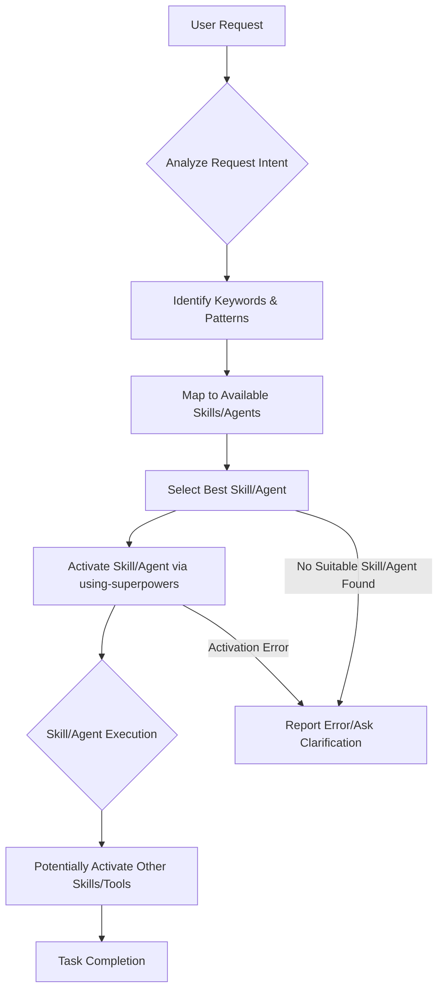

# Workflow: End-to-End User Request Handling

This document traces the complete process of how SupremePower handles a user's request, from initial input to the activation and execution of the most appropriate skill or agent. It illustrates the role of the `using-superpowers` skill as the primary dispatcher.

## Table of Contents

- [Overview](#overview)
- [The Process](#the-process)
  - [User Input](#user-input)
  - [Request Analysis](#request-analysis)
  - [Skill/Agent Selection](#skillagent-selection)
  - [Skill/Agent Activation](#skillagent-activation)
  - [Execution](#execution)
  - [Task Completion or Error Handling](#task-completion-or-error-handling)
- [Mermaid Diagram](#mermaid-diagram)

---

## Overview

SupremePower's effectiveness relies on its ability to correctly interpret user intent and dispatch the appropriate specialized skill or agent. The `using-superpowers` skill is central to this process, acting as an intelligent router that analyzes input and activates the correct component, ensuring efficiency and accuracy.

---

## The Process

### User Input

The process begins when a user provides a request or command. This can be in natural language, a specific command (like `/skills: ...`), or any input interpreted by the system.

### Request Analysis

The `using-superpowers` skill (or a similar initial handler) analyzes the user's input. This involves:
*   **Parsing:** Understanding the linguistic structure and identifying keywords.
*   **Intent Recognition:** Determining the user's underlying goal.
*   **Contextual Awareness:** Considering any relevant conversational history or state.

### Skill/Agent Selection

Based on the analysis, the system identifies potential skills or agents that could fulfill the request. This often involves:
*   **Keyword Matching:** Looking for terms that align with skill descriptions or agent expertise.
*   **Pattern Recognition:** Identifying specific command formats or structural cues.
*   **Rule Evaluation:** Applying any predefined rules or policies that guide selection.

### Skill/Agent Activation

Once a primary skill or agent is selected, it is activated. This typically involves:
*   Calling the appropriate function (e.g., `activate_skill(name='...')`).
*   Passing relevant context or data to the activated component.

### Execution

The activated skill or agent then takes over to perform its specific function. This might involve:
*   Further analysis or prompting the user.
*   Interacting with other tools or the codebase.
*   Delegating tasks to sub-agents.

### Task Completion or Error Handling

*   **Success:** If the task is completed successfully, the result is returned or presented to the user.
*   **Error/Ambiguity:** If no suitable skill is found, there's an activation error, or the task cannot be completed, the system reports an error, asks for clarification, or provides guidance.

---

## Mermaid Diagram

The following diagram illustrates the primary flow of user request handling:

---

This document provides a foundational understanding of the end-to-end user request handling workflow.

What would you like to document next? We can proceed with:
1.  **Documenting the Feature Development Workflow** (Brainstorming -> Planning -> TDD).
2.  **Documenting the Debugging Workflow** (using `systematic-debugging`).
3.  **Documenting the process of adding custom components** (agents/skills).
4.  **Analyzing the content** of specific files (e.g., skills, rules, scripts).