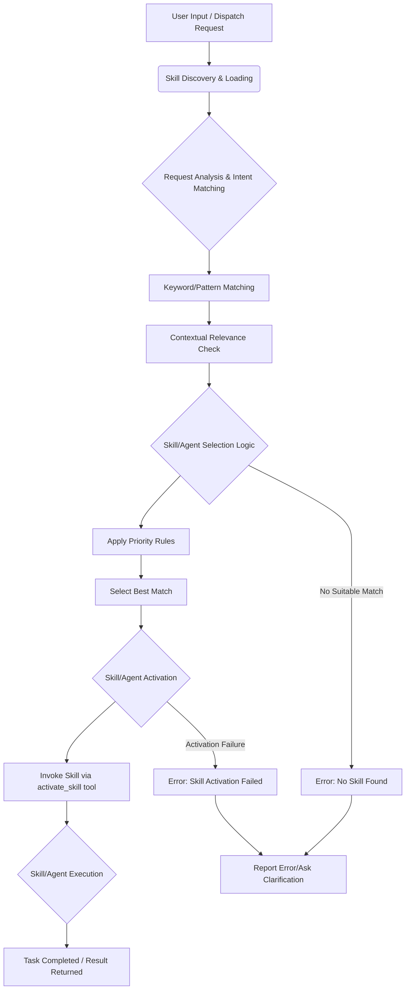

# Workflow: `using-superpowers` Skill Internal Process

This document details the internal operational flow of the `using-superpowers` skill, which is responsible for analyzing requests, identifying, and invoking other skills and agents within the SupremePower framework.

## Table of Contents

- [Overview](#overview)
- [Internal Process Stages](#internal-process-stages)
  - [Skill Discovery and Loading](#skill-discovery-and-loading)
  - [Request Analysis and Intent Matching](#request-analysis-and-intent-matching)
  - [Skill/Agent Selection Logic](#skillagent-selection-logic)
  - [Skill Activation Mechanism](#skill-activation-mechanism)
  - [Error Handling and Fallbacks](#error-handling-and-fallbacks)
- [Mermaid Diagram](#mermaid-diagram)

---

## Overview

The `using-superpowers` skill is the central dispatcher. It acts as an intelligent router, taking raw user input or internal dispatch requests and mapping them to the most appropriate specialized skill or agent. Its effectiveness is paramount to the seamless operation of the SupremePower framework.

---

## Internal Process Stages

### Skill Discovery and Loading

*   **Action:** At the start of a session or when first invoked, the skill loads available skill metadata.
*   **Mechanism:** It scans predefined directories (e.g., `/Users/steven/my-supremepowers/skills/`, `/Users/steven/my-supremepowers/qwen_skills/`) and parses skill definitions (like `SKILL.md` frontmatter or `name` fields).

### Request Analysis and Intent Matching

*   **Action:** Receives user input or a dispatched task.
*   **Mechanism:**
    *   Parses the input string to identify keywords, patterns, and potential commands (e.g., `/skills:`, skill names).
    *   Compares input against skill metadata (descriptions, names, keywords) to gauge relevance.
    *   Considers context from the environment (e.g., `gemini.md` rules, user preferences stored in memory).

### Skill/Agent Selection Logic

*   **Action:** Determines the single best skill or agent to execute the request.
*   **Mechanism:**
    *   **Direct Match:** If input explicitly names a skill.
    *   **Pattern Matching:** Using regex or string matching against skill descriptions/names.
    *   **Heuristic Scoring:** Assigning scores based on relevance and potentially other factors.
    *   **Priority Rules:** Applies defined priority (e.g., process skills before implementation skills) if multiple apply.
    *   **User Instructions:** Prioritizes explicit user commands or instructions.

### Skill Activation Mechanism

*   **Action:** Invokes the chosen skill or agent.
*   **Mechanism:**
    *   Uses the `activate_skill` tool (or equivalent depending on the environment) with the selected skill's name.
    *   Passes relevant arguments or context derived from the user's request.

### Error Handling and Fallbacks

*   **Action:** Manages situations where no suitable skill is found or activation fails.
*   **Mechanism:**
    *   Reports an error or ambiguity to the user.
    *   May prompt for clarification if intent is unclear.
    *   Could fall back to a generalist agent or default behavior if configured.

---

## Mermaid Diagram

---

This document details the internal workflow of the `using-superpowers` skill.

What would you like to document or analyze next? We can proceed with:
1.  **Analyzing the content of other specific components** (agents, rules, scripts, policies, hooks, core framework).
2.  **Reviewing the overall architecture** of the SupremePower framework.
3.  **Exploring other granular workflows** within different skills or agents.