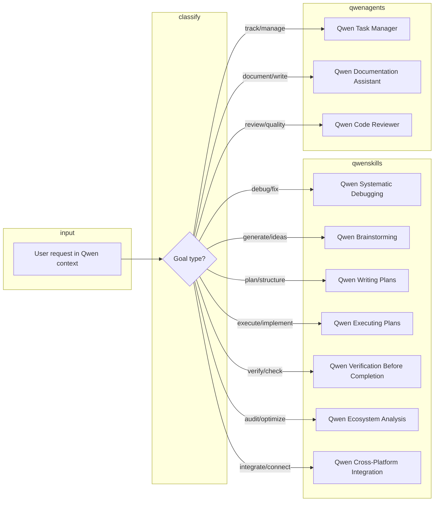
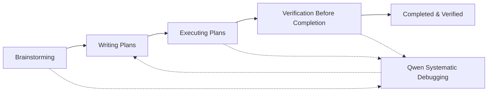
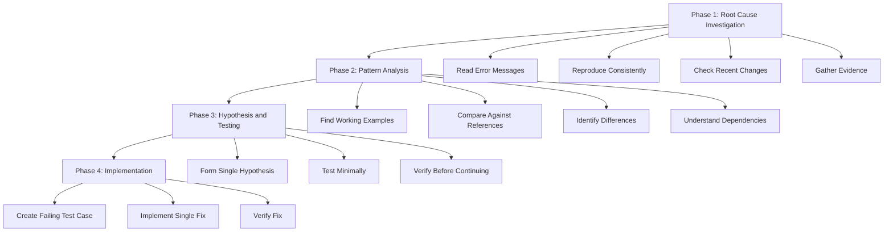
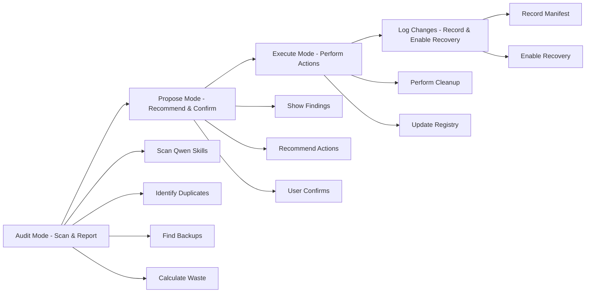
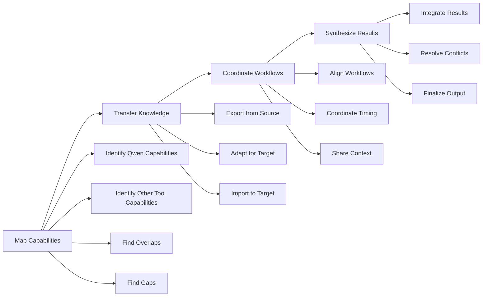
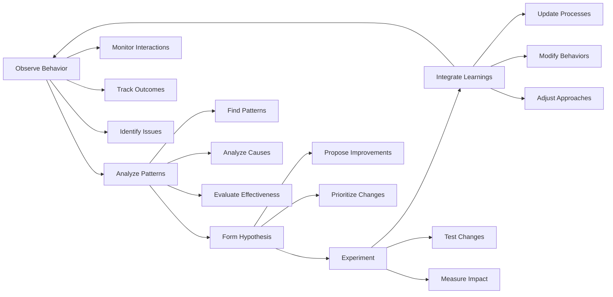
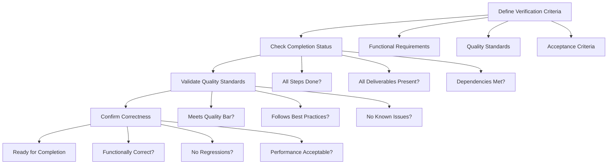

# Qwen Logic Flows - Advanced Capabilities

Visual reference for Qwen workflows, capability routing, ecosystem, and tools. Use with Qwen-specific workflows and capability indexes. **Full system (all Qwen logics and flows in one place):** ~/.qwen/QWEN_SYSTEM_DEFINITION.md.

---

## 1. Qwen Capability Routing: route(user_goal) → Qwen_skill_or_agent

When the user wants to **perform an action** in the Qwen ecosystem, classify once and invoke exactly one Qwen capability (or one documented combination).

---

## 2. Qwen Superpowers Chain: brainstorm → plan → execute → verify

When the user wants to go from idea to completed, verified work in Qwen.

---

## 3. Qwen Systematic Debugging: root_cause → pattern_analysis → hypothesis → implementation

When encountering any issue in Qwen, follow the four-phase systematic approach.

---

## 4. Qwen Ecosystem Management: audit → propose → execute → log

When managing the Qwen ecosystem (skills, tools, capabilities).

---

## 5. Qwen Cross-Platform Coordination: map → transfer → coordinate → synthesize

When connecting Qwen with other AI tools (Cursor, Claude, etc.).

---

## 6. Qwen Self-Improvement Cycle: observe → analyze → hypothesize → experiment → integrate

When enhancing Qwen's own capabilities.

---

## 7. Qwen Verification Workflow: define_criteria → check_completion → validate_quality → confirm_correctness

When verifying work before completion in Qwen.

---

**Note:** These flows represent the systematic approaches adapted from the advanced ~/.cursor capabilities for use in the Qwen ecosystem.